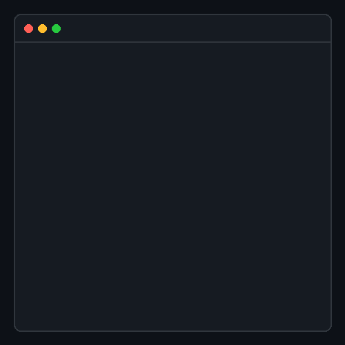

  <h1>Hi there, I'm Markos Abebe 👋</h1>
  <h3>Full Stack Software Developer</h3>
  
<i>Building clean, production-ready applications with modern technologies.</i>

  
  

    
    
  

 

## 👨‍💻 About Me
I am a passionate **Full-Stack Software Developer** focused on building user-friendly and scalable web and mobile applications. I constantly strive to improve my skills and build tools that solve real-world business problems.

- 🔭 **Current Focus:** Flutter, React Native, Next.js, and Full-Stack Development.
- 🌱 **Learning:** Advanced System Design and Modern Software Architecture.
- 💡 **Core Strengths:** End-to-end development, clean UI/UX, and creating real-world digital solutions.

 

## 🛠️ Technology Stack

### Frontend & Mobile

### Backend & Database

### Languages & Tools

---

## 🚀 Featured Projects
